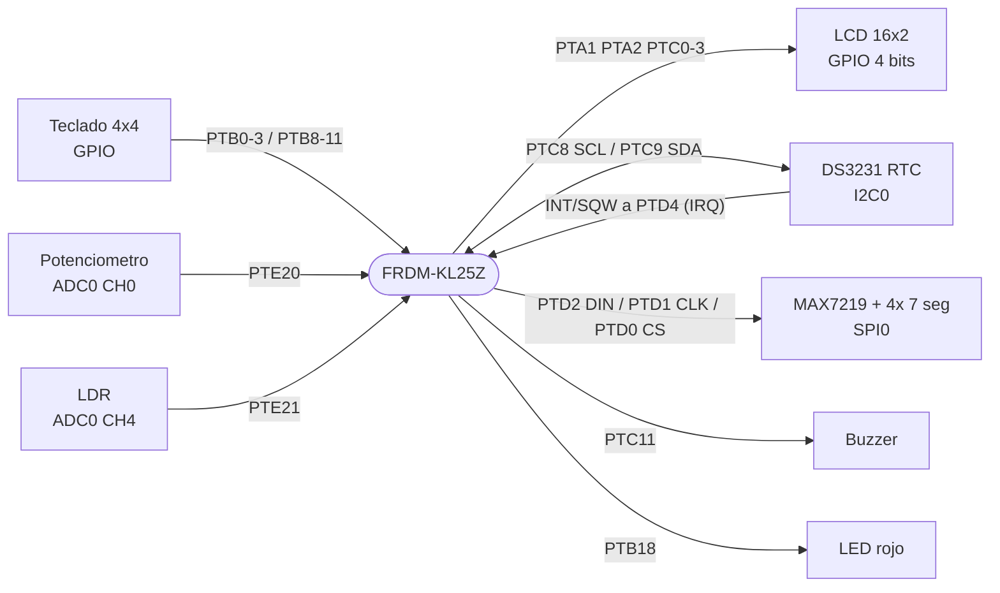
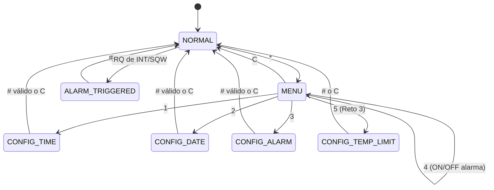

<div align="center">

# 🕒 Estación de Monitoreo I²C / SPI

### Práctica 3 · Serial Interfaces Lab · FRDM‑KL25Z


*Reloj de tiempo real, display de 7 segmentos, teclado, alarma por interrupción y sensores analógicos, todo integrado en una sola placa.*

</div>

```
 ┌────────────────┐        ┌─────────────┐
 │09/09/26 T:24.6C│        │  1 5 . 3 0  │   ← MAX7219 (HH:MM, el punto parpadea)
 │Alm: 07:30    ON│        └─────────────┘
 └────────────────┘
      ↑ LCD 16×2 en modo normal
```

---

## 📑 Tabla de contenido

1. [Sobre la práctica original](#-sobre-la-práctica-original)
2. [Estado del proyecto](#-estado-del-proyecto)
3. [Arquitectura](#-arquitectura)
4. [Hardware y conexiones](#-hardware-y-conexiones)
5. [Controles del teclado](#-controles-del-teclado)
6. [Máquina de estados](#-máquina-de-estados)
7. [Desarrollo paso a paso](#-desarrollo-paso-a-paso)
   - [Paso 1 · RTC DS3231 por I2C](#paso-1--rtc-ds3231-por-i2c)
   - [Paso 2 · Display MAX7219 por SPI](#paso-2--display-max7219-por-spi)
   - [Paso 3 · Teclado y modo configuración](#paso-3--teclado-y-modo-configuración)
   - [Paso 4 · Alarma e interrupción del RTC](#paso-4--alarma-e-interrupción-del-rtc)
   - [Paso 5 · Monitoreo de temperatura](#paso-5--monitoreo-de-temperatura)
   - [Paso 6 · Estación completa](#paso-6--estación-completa)
8. [Retos extra](#-retos-extra)
9. [Pruebas y demostración](#-pruebas-y-demostración)
10. [Lecciones aprendidas](#-lecciones-aprendidas)
11. [Pendientes y mejoras](#-pendientes-y-mejoras)
12. [Archivos del proyecto](#-archivos-del-proyecto)
13. [Compilar y cargar](#-compilar-y-cargar)

---

## 📖 Sobre la práctica original

**Serial Interfaces Lab · Practice 3 – I²C/SPI Monitoring Station.**
El objetivo era integrar las interfaces **I²C** y **SPI** en una estación de monitoreo completa que combina un RTC, un sensor de temperatura, un teclado, una LCD, un display MAX7219 y un sistema de alarma. La práctica se desarrolla de forma progresiva: cada paso añade un componente que luego forma parte del sistema final.

### Hardware requerido por la práctica

KL25Z · módulo RTC DS3231 · sensor de temperatura I²C · módulo MAX7219 · displays de 7 segmentos (4) · teclado matricial 4×4 · LCD · buzzer · LED · resistencias, protoboard y jumpers.

### Pasos de la práctica

| Paso | Tema | Qué pedía |
|:---:|---|---|
| **1** | RTC: fecha y hora | DS3231 por I²C, configurar y leer fecha/hora, mostrarla en la LCD |
| **2** | Display SPI | MAX7219 por SPI mostrando la hora **HH:MM** tomada del DS3231 |
| **3** | Teclado | Modo *Configuración* (hora, fecha, confirmar, cancelar) distinto del modo *Normal* |
| **4** | Alarma e interrupción | Alarma del DS3231, pin **INT/SQW** a un GPIO con interrupción, buzzer, LED y mensaje en LCD, aceptar con el teclado |
| **5** | Temperatura I²C | Sensor I²C distinto del DS3231 **en el mismo bus** |
| **6** | Estación completa | Modos Normal, Configuración y Alarma integrados |

### Retos extra (hasta +30 puntos)

| Reto | Puntos |
|---|:---:|
| 1 · LCD con interfaz I²C | +10 |
| 2 · Mediciones ambientales adicionales (humedad y presión con BME280) | +5 |
| 3 · Alarma por umbral de temperatura | +5 |
| 4 · Sensor I²C adicional | +5 |
| 5 · Sensor adicional con otra interfaz (SPI, analógico…) | +5 |

---

## ✅ Estado del proyecto

| Sección | Estado | Notas |
|---|:---:|---|
| Paso 1 · RTC + LCD | ✅ | Lectura y escritura por ráfaga de 7 registros |
| Paso 2 · MAX7219 por SPI | ✅ | Hora leída directamente del DS3231 |
| Paso 3 · Teclado y configuración | ✅ | Hora y fecha con validación |
| Paso 4 · Alarma por interrupción | ✅ | INT/SQW → **PTD4** (PORTD tiene IRQ) |
| Paso 5 · Temperatura | ⚠️ | **Simulada con potenciómetro en ADC.** La práctica pide un sensor I²C: ver [Pendientes](#-pendientes-y-mejoras) |
| Paso 6 · Estación completa | ✅ | Menú de configuración, alarma ON/OFF y modo alarma |
| Reto 1 · LCD I²C | ❌ | No implementado (LCD en paralelo, 4 bits) |
| Reto 2 · BME280 (humedad y presión) | ❌ | No implementado |
| Reto 3 · Umbral de temperatura | ✅ | Sobre la temperatura simulada |
| Reto 4 · Segundo sensor I²C | ❌ | No implementado |
| Reto 5 · Sensor con otra interfaz | ✅ | LDR por ADC (canal 4) |

---

## 🧩 Arquitectura



El firmware está organizado en **bloques de funciones** (dentro de un solo `.c` por paso), uno por periférico, y una máquina de estados en `main()`:

| Bloque | Funciones principales |
|---|---|
| Delays | `Delay_us`, `Delay_ms` |
| LCD | `LCD_Init`, `LCD_Clear`, `LCD_SetCursor`, `LCD_WriteString`, `LCD_WriteLine` |
| I²C | `I2C0_Init`, `I2C_Start`, `I2C_Stop`, `I2C_WriteByte`, `I2C_ReadBytes`, `I2C_Probe`, `I2C_BusRecover` |
| DS3231 | `DS3231_Init`, `DS3231_SetDateTime`, `DS3231_ReadDateTime`, `DS3231_SetAlarm1` |
| SPI / MAX7219 | `SPI0_Init`, `SPI0_Transfer`, `MAX7219_Init`, `MAX7219_ShowTime` |
| Teclado | `Keypad_Init`, `Keypad_GetKey` |
| Alarma / interrupción | `Alarm_Hardware_Init`, `PORTD_IRQHandler` |
| ADC | `ADC0_Init`, `ADC0_Read` |
| Aplicación | `ShowConfigScreen`, `ShowMenuScreen`, `StartInput`, `main` (máquina de estados) |

### Secuencia de arranque (Paso 6)

```
LCD_Init → Keypad_Init → MAX7219_Init → I2C0_Init → Alarm_Hardware_Init → ADC0_Init
   → I2C_Probe(0x68) → DS3231_Init → DS3231_SetAlarm1 → "Station Ready" → bucle principal
```

---

## 🔌 Hardware y conexiones

| Periférico | Señal | Pin KL25Z | Detalle |
|---|---|:---:|---|
| **LCD 16×2** | RS | `PTA1` | GPIO |
| | EN | `PTA2` | GPIO |
| | D4 · D5 · D6 · D7 | `PTC0` · `PTC1` · `PTC2` · `PTC3` | GPIO, modo de 4 bits |
| | RW | GND | Solo escritura |
| | V0 | Potenciómetro 10 kΩ | Contraste (≈ 0.4–1 V) |
| **DS3231** | SCL | `PTC8` | `I2C0_SCL`, ALT2, pull-up interno |
| | SDA | `PTC9` | `I2C0_SDA`, ALT2, pull-up interno |
| | INT/SQW | `PTD4` | GPIO con IRQ por flanco de bajada |
| | VCC | 3.3 V | Dirección I²C `0x68` |
| **MAX7219** | DIN | `PTD2` | `SPI0_MOSI`, ALT2 |
| | CLK | `PTD1` | `SPI0_SCK`, ALT2 (comparte el LED azul de la placa) |
| | CS / LOAD | `PTD0` | GPIO, controlado por software |
| | VCC | 5 V | |
| **Teclado 4×4** | Filas R1–R4 | `PTB0`–`PTB3` | Salidas |
| | Columnas C1–C4 | `PTB8`–`PTB11` | Entradas con pull-up |
| **Alarma** | Buzzer | `PTC11` | Activo en alto |
| | LED rojo | `PTB18` | LED integrado, **activo en bajo** |
| **Analógico** | Potenciómetro (temperatura simulada) | `PTE20` | `ADC0` canal 0 |
| | LDR (Reto 5) | `PTE21` | `ADC0` canal 4 |

> 💡 `PTE24`/`PTE25` se fuerzan a `MUX(0)` para que el acelerómetro de la placa no comparta el periférico I2C0.
> 💡 Todos los GND deben ser comunes. Las líneas de I²C llevan pull-up (las del módulo DS3231 más las internas del micro).

**Parámetros de bus:** I²C ≈ 100 kHz (`I2C0->F = 0x1F`, bus de 24 MHz) · SPI modo 0, MSB primero, 2 MHz (`SPPR = 2`, `SPR = 1`).

---

## 🎹 Controles del teclado

```
┌───┬───┬───┬───┐
│ 1 │ 2 │ 3 │ A │
├───┼───┼───┼───┤
│ 4 │ 5 │ 6 │ B │
├───┼───┼───┼───┤
│ 7 │ 8 │ 9 │ C │
├───┼───┼───┼───┤
│ * │ 0 │ # │ D │
└───┴───┴───┴───┘
```

Mapa de la versión final (Paso 6):

| Tecla | Modo normal | Menú | Configuración | Alarma sonando |
|:---:|---|---|---|---|
| `*` | Abre el menú | | | |
| `1` | | Configurar **hora** | Dígito | |
| `2` | | Configurar **fecha** | Dígito | |
| `3` | | Configurar **alarma** | Dígito | |
| `4` | | **Activar / desactivar** la alarma | Dígito | |
| `5` | | Límite de temperatura (Reto 3) | Dígito | |
| `0`–`9` | | | Dígitos | |
| `B` | | | Borrar último dígito | |
| `C` | | Salir al modo normal | Cancelar | |
| `#` | | | Confirmar | **Detener la alarma** |

Formatos de entrada: hora `HHMM` (4 dígitos) · fecha `DDMMAA` (6 dígitos) · alarma `HHMM` · límite de temperatura `TT` (2 dígitos).

---

## 🔄 Máquina de estados



> La alarma del RTC puede interrumpir **cualquier modo**: la ISR solo levanta una bandera (`alarmFiredFlag`) y el bucle principal pasa a `MODE_ALARM_TRIGGERED` si la alarma está habilitada.

---

## 🚀 Desarrollo paso a paso

Cada paso parte del anterior. Los bloques de código aparecen **la primera vez que se introducen**; los controladores que no cambian entre pasos (LCD, I²C, DS3231, SPI/MAX7219) se muestran una sola vez.

### Paso 1 · RTC DS3231 por I2C

📄 `I2C_Step1`

**Lo que pedía:** conectar el DS3231 por I²C, identificar su dirección, inicializar el periférico, configurar una fecha/hora válida, leerla, mostrarla en la LCD y verificar que avanza.

**Cómo se resolvió**
- Dirección **`0x68`**, verificada al arrancar con `I2C_Probe`.
- `DS3231_Init` enciende el oscilador y limpia banderas (`control = 0x1C`, `status = 0x00`).
- Escritura y lectura de los **7 registros de tiempo en una sola transacción** (evita lecturas inconsistentes cuando cambian los segundos).
- La LCD solo se refresca cuando cambia el segundo.
- `SET_TIME_ON_BOOT` permite escribir la hora al arrancar o conservar la del RTC.

<details>
<summary><b>📦 Código: configuración, delays, LCD, I²C y DS3231</b></summary>

> Los pasos 1 y 2 usan la LCD en una versión expandida (`LCD_WriteDataPins`, `LCD_EnablePulse`…). A partir del paso 3 se compactó, con el mismo comportamiento. Aquí se muestra la versión compacta.

```c
#include "MKL25Z4.h"
#include <stdint.h>
#include <stdio.h>
#include <string.h>

/* ---------- LCD 16x2 (4 bits) ---------- */
#define LCD_RS_PIN      1
#define LCD_EN_PIN      2
#define LCD_D4_PIN      0
#define LCD_D5_PIN      1
#define LCD_D6_PIN      2
#define LCD_D7_PIN      3

/* ---------- DS3231 ---------- */
#define DS3231_I2C_ADDR    0x68
#define I2C_TIMEOUT        100000U

#define DS3231_REG_CONTROL 0x0E
#define DS3231_REG_STATUS  0x0F
#define SET_TIME_ON_BOOT   1     /* 1 = escribe la hora al arrancar */

typedef struct
{
    uint8_t seconds;
    uint8_t minutes;
    uint8_t hours;
    uint8_t day;
    uint8_t month;
    uint8_t year;
} DateTime;

/* ---------- Delays y conversiones BCD ---------- */
void Delay_us(uint32_t us) { for(uint32_t i=0; i<us; i++) for(uint32_t j=0; j<8; j++) __NOP(); }
void Delay_ms(uint32_t ms) { for(uint32_t i=0; i<ms; i++) Delay_us(1000); }

uint8_t BCD_To_Decimal(uint8_t b) { return ((b >> 4) * 10) + (b & 0x0F); }
uint8_t Decimal_To_BCD(uint8_t d) { return ((d / 10) << 4) | (d % 10); }

/* ---------- LCD 16x2 ---------- */
void LCD_GPIO_Init(void) {
    SIM->SCGC5 |= SIM_SCGC5_PORTA_MASK | SIM_SCGC5_PORTC_MASK;
    PORTA->PCR[LCD_RS_PIN] = PORT_PCR_MUX(1);
    PORTA->PCR[LCD_EN_PIN] = PORT_PCR_MUX(1);
    for(int i=0; i<=3; i++) PORTC->PCR[i] = PORT_PCR_MUX(1);
    PTA->PDDR |= (1 << LCD_RS_PIN) | (1 << LCD_EN_PIN);
    PTC->PDDR |= 0x0F;
}

void LCD_Send4Bits(uint8_t val) {
    PTC->PCOR = 0x0F;
    if (val & 0x01) PTC->PSOR = (1 << 0);
    if (val & 0x02) PTC->PSOR = (1 << 1);
    if (val & 0x04) PTC->PSOR = (1 << 2);
    if (val & 0x08) PTC->PSOR = (1 << 3);
    PTA->PSOR = (1 << LCD_EN_PIN); Delay_us(2);
    PTA->PCOR = (1 << LCD_EN_PIN); Delay_us(50);
}

void LCD_SendCommand(uint8_t cmd) {
    PTA->PCOR = (1 << LCD_RS_PIN);
    LCD_Send4Bits(cmd >> 4); LCD_Send4Bits(cmd & 0x0F);
    Delay_ms(cmd <= 2 ? 2 : 1);
}

void LCD_SendData(uint8_t data) {
    PTA->PSOR = (1 << LCD_RS_PIN);
    LCD_Send4Bits(data >> 4); LCD_Send4Bits(data & 0x0F);
}

void LCD_Init(void) {
    LCD_GPIO_Init(); Delay_ms(40);
    PTA->PCOR = (1 << LCD_RS_PIN) | (1 << LCD_EN_PIN);
    LCD_Send4Bits(0x03); Delay_ms(5);
    LCD_Send4Bits(0x03); Delay_us(150);
    LCD_Send4Bits(0x03); Delay_us(150);
    LCD_Send4Bits(0x02); Delay_us(150);
    LCD_SendCommand(0x28); LCD_SendCommand(0x0C); LCD_SendCommand(0x06); LCD_SendCommand(0x01); Delay_ms(2);
}

void LCD_Clear(void) { LCD_SendCommand(0x01); Delay_ms(2); }
void LCD_SetCursor(uint8_t r, uint8_t c) { LCD_SendCommand(0x80 | ((r == 0 ? 0x00 : 0x40) + c)); }
void LCD_WriteString(const char *s) { while (*s) LCD_SendData((uint8_t)*s++); }

void LCD_WriteLine(uint8_t row, const char *s) {
    char line[17];
    snprintf(line, sizeof(line), "%-16s", s);   /* rellena con espacios: no deja basura */
    LCD_SetCursor(row, 0);
    LCD_WriteString(line);
}

/* ---------- I2C0: PTC8 = SCL, PTC9 = SDA (ALT2) ---------- */

/* Emulación open-drain con GPIO para recuperar el bus */
#define SCL_LOW()    do { PTC->PCOR = (1u << 8); PTC->PDDR |=  (1u << 8); } while (0)
#define SCL_HIGH()   do { PTC->PDDR &= ~(1u << 8); } while (0)
#define SDA_LOW()    do { PTC->PCOR = (1u << 9); PTC->PDDR |=  (1u << 9); } while (0)
#define SDA_HIGH()   do { PTC->PDDR &= ~(1u << 9); } while (0)
#define SDA_READ()   ((PTC->PDIR >> 9) & 1u)

/* Libera el bus si un esclavo quedó sujetando SDA en bajo:
 * hasta 9 pulsos de SCL y luego una condición STOP. */
static void I2C_BusRecover(void) {
    uint8_t i;
    SIM->SCGC5 |= SIM_SCGC5_PORTC_MASK;
    PORTC->PCR[8] = PORT_PCR_MUX(1) | PORT_PCR_PE_MASK | PORT_PCR_PS_MASK;
    PORTC->PCR[9] = PORT_PCR_MUX(1) | PORT_PCR_PE_MASK | PORT_PCR_PS_MASK;
    SCL_HIGH(); SDA_HIGH(); Delay_us(20);
    for (i = 0; i < 9; i++) {
        if (SDA_READ()) break;
        SCL_LOW(); Delay_us(20); SCL_HIGH(); Delay_us(20);
    }
    SDA_LOW(); Delay_us(20); SCL_HIGH(); Delay_us(20); SDA_HIGH(); Delay_us(20);
}

void I2C0_Init(void) {
    SIM->SCGC4 |= SIM_SCGC4_I2C0_MASK;
    SIM->SCGC5 |= SIM_SCGC5_PORTC_MASK | SIM_SCGC5_PORTE_MASK;
    I2C0->C1 = 0x00;
    PORTE->PCR[24] = PORT_PCR_MUX(0);     /* libera I2C0 del acelerómetro de la placa */
    PORTE->PCR[25] = PORT_PCR_MUX(0);
    I2C_BusRecover();
    PORTC->PCR[8] = PORT_PCR_MUX(2) | PORT_PCR_PE_MASK | PORT_PCR_PS_MASK;
    PORTC->PCR[9] = PORT_PCR_MUX(2) | PORT_PCR_PE_MASK | PORT_PCR_PS_MASK;
    I2C0->F  = 0x1F;                      /* ~100 kHz con bus de 24 MHz */
    I2C0->C1 = I2C_C1_IICEN_MASK;
    I2C0->S = I2C_S_IICIF_MASK | I2C_S_ARBL_MASK;   /* w1c */
}

static uint8_t I2C_WaitIICIF(void) {
    uint32_t t = I2C_TIMEOUT;
    while ((I2C0->S & I2C_S_IICIF_MASK) == 0) { if (--t == 0) return 0; }
    I2C0->S = I2C_S_IICIF_MASK; return 1;
}

static uint8_t I2C_WaitBusIdle(void) {
    uint32_t t = I2C_TIMEOUT;
    while (I2C0->S & I2C_S_BUSY_MASK) { if (--t == 0) return 0; }
    return 1;
}

static uint8_t I2C_Start(void) {
    if (I2C0->S & I2C_S_ARBL_MASK) I2C0->S = I2C_S_ARBL_MASK;
    if (!I2C_WaitBusIdle()) { I2C0_Init(); if (!I2C_WaitBusIdle()) return 0; }
    I2C0->C1 |= I2C_C1_TX_MASK | I2C_C1_MST_MASK; return 1;
}

static void I2C_Stop(void) {
    I2C0->C1 &= ~(I2C_C1_MST_MASK | I2C_C1_TX_MASK | I2C_C1_TXAK_MASK);
    I2C_WaitBusIdle();
}

static uint8_t I2C_WriteByte(uint8_t data) {
    I2C0->D = data; if (!I2C_WaitIICIF()) return 0;
    if (I2C0->S & I2C_S_RXAK_MASK) return 0;      /* NACK */
    return 1;
}

/* Lee 'len' bytes. El STOP se genera ANTES de leer el último byte. */
static uint8_t I2C_ReadBytes(uint8_t *buf, uint8_t len) {
    I2C0->C1 &= ~I2C_C1_TX_MASK;
    if (len == 1) I2C0->C1 |= I2C_C1_TXAK_MASK; else I2C0->C1 &= ~I2C_C1_TXAK_MASK;
    (void)I2C0->D;
    for (uint8_t i = 0; i < len; i++) {
        if (!I2C_WaitIICIF()) { I2C_Stop(); return 0; }
        if ((len >= 2) && (i == (uint8_t)(len - 2))) I2C0->C1 |= I2C_C1_TXAK_MASK;
        if (i == (uint8_t)(len - 1)) {
            I2C0->C1 &= ~(I2C_C1_MST_MASK | I2C_C1_TXAK_MASK);
            buf[i] = I2C0->D; I2C_WaitBusIdle();
        } else { buf[i] = I2C0->D; }
    }
    return 1;
}

/* Devuelve 1 si hay un dispositivo que hace ACK en la dirección de 7 bits */
uint8_t I2C_Probe(uint8_t addr7) {
    if (!I2C_Start()) return 0;
    uint8_t ok = I2C_WriteByte((uint8_t)(addr7 << 1));
    I2C_Stop(); return ok;
}

/* ---------- DS3231 ---------- */
uint8_t DS3231_WriteRegisters(uint8_t reg, const uint8_t *data, uint8_t len) {
    if (!I2C_Start()) return 0;
    if (!I2C_WriteByte(DS3231_I2C_ADDR << 1)) { I2C_Stop(); return 0; }
    if (!I2C_WriteByte(reg))                  { I2C_Stop(); return 0; }
    for (uint8_t i = 0; i < len; i++) { if (!I2C_WriteByte(data[i])) { I2C_Stop(); return 0; } }
    I2C_Stop(); return 1;
}

uint8_t DS3231_ReadRegisters(uint8_t reg, uint8_t *buf, uint8_t len) {
    if (!I2C_Start()) return 0;
    if (!I2C_WriteByte(DS3231_I2C_ADDR << 1)) { I2C_Stop(); return 0; }
    if (!I2C_WriteByte(reg))                  { I2C_Stop(); return 0; }
    I2C0->C1 |= I2C_C1_RSTA_MASK;             /* repeated start */
    if (!I2C_WriteByte((DS3231_I2C_ADDR << 1) | 1)) { I2C_Stop(); return 0; }
    return I2C_ReadBytes(buf, len);
}

/* Enciende el oscilador, desactiva alarmas y limpia la bandera OSF */
uint8_t DS3231_Init(void) {
    uint8_t control = 0x1C;   /* EOSC = 0 (oscilador ON), INTCN = 1, alarmas OFF */
    uint8_t status  = 0x00;   /* OSF = 0, A1F = A2F = 0 */
    if (!DS3231_WriteRegisters(DS3231_REG_CONTROL, &control, 1)) return 0;
    if (!DS3231_WriteRegisters(DS3231_REG_STATUS,  &status,  1)) return 0;
    return 1;
}

uint8_t DS3231_SetDateTime(const DateTime *dt) {
    uint8_t regs[7];
    regs[0] = Decimal_To_BCD(dt->seconds);    /* 0x00 segundos */
    regs[1] = Decimal_To_BCD(dt->minutes);    /* 0x01 minutos */
    regs[2] = Decimal_To_BCD(dt->hours);      /* 0x02 horas (24 h) */
    regs[3] = 1;                              /* 0x03 día de la semana */
    regs[4] = Decimal_To_BCD(dt->day);        /* 0x04 fecha */
    regs[5] = Decimal_To_BCD(dt->month);      /* 0x05 mes */
    regs[6] = Decimal_To_BCD(dt->year);       /* 0x06 año */
    return DS3231_WriteRegisters(0x00, regs, 7);
}

uint8_t DS3231_ReadDateTime(DateTime *dt) {
    uint8_t regs[7];
    if (!DS3231_ReadRegisters(0x00, regs, 7)) return 0;
    dt->seconds = BCD_To_Decimal(regs[0] & 0x7F);
    dt->minutes = BCD_To_Decimal(regs[1] & 0x7F);
    dt->hours   = BCD_To_Decimal(regs[2] & 0x3F);
    dt->day     = BCD_To_Decimal(regs[4] & 0x3F);
    dt->month   = BCD_To_Decimal(regs[5] & 0x1F);   /* bit 7 = siglo */
    dt->year    = BCD_To_Decimal(regs[6]);
    return 1;
}
```

</details>

<details>
<summary><b>📦 Código: <code>main()</code> del Paso 1</b></summary>

```c
int main(void)
{
    DateTime dt;
    char buffer1[17];
    char buffer2[17];
    uint8_t lastSec = 0xFF;

    LCD_Init();
    LCD_SetCursor(0, 0);
    LCD_WriteString("Paso 1: DS3231");

    I2C0_Init();

    /* 1) Verificar que el DS3231 responde en 0x68 */
    while (!I2C_Probe(DS3231_I2C_ADDR))
    {
        LCD_Clear();
        LCD_SetCursor(0, 0);
        LCD_WriteString("DS3231 NO ACK");
        LCD_SetCursor(1, 0);
        LCD_WriteString("Revisa SDA/SCL");
        Delay_ms(1000);
        I2C0_Init();
    }

    LCD_Clear();
    LCD_SetCursor(0, 0);
    LCD_WriteString("DS3231 OK 0x68");
    Delay_ms(1000);

    /* 2) Inicializar el RTC */
    if (!DS3231_Init())
    {
        LCD_Clear();
        LCD_SetCursor(0, 0);
        LCD_WriteString("INIT ERROR");
        while (1) {}
    }

#if SET_TIME_ON_BOOT
    /* Fecha y hora inicial */
    dt.day     = 30;
    dt.month   = 9;
    dt.year    = 26;
    dt.hours   = 17;
    dt.minutes = 33;
    dt.seconds = 25;

    if (!DS3231_SetDateTime(&dt))
    {
        LCD_Clear();
        LCD_SetCursor(0, 0);
        LCD_WriteString("SET ERROR");
        while (1) {}
    }
#endif

    LCD_Clear();

    while (1)
    {
        if (!DS3231_ReadDateTime(&dt))
        {
            LCD_SetCursor(0, 0);
            LCD_WriteString("READ ERROR      ");
            LCD_SetCursor(1, 0);
            LCD_WriteString("                ");
            I2C0_Init();                 /* intentar recuperar el bus */
            lastSec = 0xFF;
            Delay_ms(500);
            continue;
        }

        if (dt.seconds != lastSec)
        {
            lastSec = dt.seconds;

            snprintf(buffer1, sizeof(buffer1), "Date: %02u/%02u/%02u  ",
                     (unsigned)dt.day, (unsigned)dt.month, (unsigned)dt.year);
            snprintf(buffer2, sizeof(buffer2), "Time: %02u:%02u:%02u  ",
                     (unsigned)dt.hours, (unsigned)dt.minutes, (unsigned)dt.seconds);

            LCD_SetCursor(0, 0);
            LCD_WriteString(buffer1);

            LCD_SetCursor(1, 0);
            LCD_WriteString(buffer2);
        }

        Delay_ms(100);
    }
}
```

</details>

Pantalla resultante:

```
┌────────────────┐
│Date: 30/09/26  │
│Time: 17:33:25  │
└────────────────┘
```

---

### Paso 2 · Display MAX7219 por SPI

📄 `I2C_Step2`

**Lo que pedía:** conectar e inicializar el MAX7219 por SPI, configurar sus registros y mostrar en HH:MM la hora obtenida directamente del DS3231, dejando la LCD con información adicional (fecha).

**Cómo se resolvió**
- **SPI0** en modo 0, MSB primero, a 2 MHz. `CS/LOAD` se maneja **por GPIO**, porque el MAX7219 necesita 16 bits seguidos con LOAD en bajo.
- Inicialización: *shutdown* → *test off* → `SCANLIMIT = 3` (4 dígitos) → `DECODE = 0x0F` (BCD en DIG0–DIG3) → intensidad `0x08` → limpiar → encender.
- El **punto decimal del 2.º dígito** hace de separador `:` y parpadea cada segundo.
- `MAX_REVERSE_DIGITS` invierte el orden de los dígitos si el módulo tiene DIG0 a la derecha.

<details>
<summary><b>📦 Código: SPI0 y MAX7219</b></summary>

```c
/* ---------- MAX7219 ---------- */
#define MAX_CS_PIN          0       /* PTD0 */

#define MAX_REG_NOOP        0x00
#define MAX_REG_DIGIT0      0x01    /* 0x01..0x08 = dígitos 0..7 */
#define MAX_REG_DECODE      0x09
#define MAX_REG_INTENSITY   0x0A
#define MAX_REG_SCANLIMIT   0x0B
#define MAX_REG_SHUTDOWN    0x0C
#define MAX_REG_TEST        0x0F

#define MAX_NUM_DIGITS      4
#define MAX_BLANK           0x0F    /* Code B: dígito en blanco */
#define MAX_DP              0x80    /* bit del punto decimal */

/* 0 = DIG0 es el display de la IZQUIERDA, 1 = DIG0 es el de la DERECHA */
#define MAX_REVERSE_DIGITS  0

/* ---------- SPI0: PTD1 = SCK, PTD2 = MOSI (ALT2), PTD0 = CS (GPIO) ---------- */
void SPI0_Init(void)
{
    SIM->SCGC4 |= SIM_SCGC4_SPI0_MASK;
    SIM->SCGC5 |= SIM_SCGC5_PORTD_MASK;

    PORTD->PCR[1] = PORT_PCR_MUX(2);              /* SPI0_SCK  */
    PORTD->PCR[2] = PORT_PCR_MUX(2);              /* SPI0_MOSI */

    PORTD->PCR[MAX_CS_PIN] = PORT_PCR_MUX(1);
    PTD->PSOR  = (1u << MAX_CS_PIN);              /* CS en alto (inactivo) */
    PTD->PDDR |= (1u << MAX_CS_PIN);

    SPI0->C1 = 0x00;
    SPI0->C2 = 0x00;
    SPI0->BR = SPI_BR_SPPR(2) | SPI_BR_SPR(1);    /* 24 MHz / 12 = 2 MHz */
    SPI0->C1 = SPI_C1_SPE_MASK | SPI_C1_MSTR_MASK;
}

uint8_t SPI0_Transfer(uint8_t data)
{
    uint32_t t = I2C_TIMEOUT;
    while (((SPI0->S & SPI_S_SPTEF_MASK) == 0) && (--t != 0)) {}   /* TX libre */
    SPI0->D = data;
    t = I2C_TIMEOUT;
    while (((SPI0->S & SPI_S_SPRF_MASK) == 0) && (--t != 0)) {}    /* byte completo */
    return SPI0->D;
}

/* ---------- MAX7219 ---------- */
void MAX7219_Write(uint8_t reg, uint8_t value)
{
    PTD->PCOR = (1u << MAX_CS_PIN);               /* LOAD = 0 */
    (void)SPI0_Transfer(reg);
    (void)SPI0_Transfer(value);
    PTD->PSOR = (1u << MAX_CS_PIN);               /* LOAD = 1 -> latch */
}

static uint8_t MAX7219_DigitReg(uint8_t pos)      /* pos 0 = izquierda */
{
#if MAX_REVERSE_DIGITS
    return (uint8_t)(MAX_REG_DIGIT0 + (MAX_NUM_DIGITS - 1 - pos));
#else
    return (uint8_t)(MAX_REG_DIGIT0 + pos);
#endif
}

void MAX7219_Clear(void)
{
    for (uint8_t i = 0; i < MAX_NUM_DIGITS; i++)
        MAX7219_Write(MAX7219_DigitReg(i), MAX_BLANK);
}

void MAX7219_Init(void)
{
    SPI0_Init();

    MAX7219_Write(MAX_REG_SHUTDOWN,  0x00);       /* apagado mientras se configura */
    MAX7219_Write(MAX_REG_TEST,      0x00);       /* modo prueba OFF */
    MAX7219_Write(MAX_REG_SCANLIMIT, MAX_NUM_DIGITS - 1);   /* solo DIG0..DIG3 */
    MAX7219_Write(MAX_REG_DECODE,    0x0F);       /* Code B en DIG0..DIG3 */
    MAX7219_Write(MAX_REG_INTENSITY, 0x08);       /* brillo medio (0x00..0x0F) */

    MAX7219_Clear();

    MAX7219_Write(MAX_REG_SHUTDOWN,  0x01);       /* operación normal */
}

/* Muestra HH:MM. El punto decimal del 2º dígito hace de separador ':'
 * y parpadea cada segundo cuando 'sep' alterna entre 0 y 1. */
void MAX7219_ShowTime(uint8_t hours, uint8_t minutes, uint8_t sep)
{
    uint8_t d[MAX_NUM_DIGITS];

    d[0] = hours   / 10;
    d[1] = hours   % 10;
    d[2] = minutes / 10;
    d[3] = minutes % 10;

    if (sep) d[1] |= MAX_DP;

    for (uint8_t i = 0; i < MAX_NUM_DIGITS; i++)
        MAX7219_Write(MAX7219_DigitReg(i), d[i]);
}
```

</details>

<details>
<summary><b>📦 Cambios en <code>main()</code> respecto al Paso 1</b></summary>

```c
    LCD_Init();
    LCD_SetCursor(0, 0);
    LCD_WriteString("Paso 2: MAX7219");

    MAX7219_Init();          /* NUEVO */
    I2C0_Init();
    ...
        if (dt.seconds != lastSec)
        {
            lastSec = dt.seconds;
            /* NUEVO: HH:MM del DS3231 en los 7 segmentos, separador parpadeando */
            MAX7219_ShowTime(dt.hours, dt.minutes, (uint8_t)(dt.seconds & 1u));
            /* ... la LCD sigue mostrando fecha y hora como en el Paso 1 ... */
        }
```

</details>

Resultado: el display muestra `15.30` (con el punto intermitente) mientras la LCD sigue mostrando fecha y hora.

---

### Paso 3 · Teclado y modo configuración

📄 `I2C_Step3`

**Lo que pedía:** usar el teclado como dispositivo de entrada principal, con un modo *Configuración* para fijar hora y fecha (confirmar o cancelar), instrucciones en la LCD, un mapa de teclas documentado y al menos dos modos (*Normal* y *Configuración*).

**Cómo se resolvió**
- **Escaneo matricial:** las filas (`PTB0`–`PTB3`) son salidas en alto; se baja una fila a la vez y se leen las columnas (`PTB8`–`PTB11`, entradas con pull-up).
- **Antirrebote** de 20 ms y espera a que la tecla se suelte.
- En **modo normal** se usa `Keypad_GetKey` (no bloquea, el reloj sigue avanzando); en **configuración** se usa `Keypad_WaitKey` (bloqueante).
- Al arrancar pregunta `Configurar reloj  #=Si  C=No`.
- Los dígitos se capturan en un buffer; los pendientes se muestran como `_` (`SET TIME  HH:MM` → `12:3_`).
- **Validación:** hora < 24, minutos < 60, mes 1–12 y día ≤ días del mes (con año bisiesto, 2000–2099).
- Flujo: **hora → fecha → guardar** (segundos en 0) → `Guardado OK`.

| Tecla (Paso 3) | Función |
|:---:|---|
| `#` | Normal: entrar a configuración · Configuración: **confirmar** |
| `0`–`9` | Dígitos |
| `B` | Borrar el último dígito |
| `C` | Cancelar y volver a modo normal sin guardar |

```
SET TIME  HH:MM          SET DATE
12:35                    09/09/26
```

<details>
<summary><b>📦 Código: teclado matricial</b></summary>

```c
/* ---------- KEYPAD ---------- */
#define KP_ROW0_PIN        0      /* PTB0..PTB3  = filas */
#define KP_COL0_PIN        8      /* PTB8..PTB11 = columnas */

void Keypad_Init(void)
{
    SIM->SCGC5 |= SIM_SCGC5_PORTB_MASK;

    for (int i = 0; i < 4; i++) {
        PORTB->PCR[KP_ROW0_PIN + i] = PORT_PCR_MUX(1);
        PTB->PSOR  = (1u << (KP_ROW0_PIN + i));
        PTB->PDDR |= (1u << (KP_ROW0_PIN + i));
    }

    for (int i = 0; i < 4; i++) {
        PORTB->PCR[KP_COL0_PIN + i] = PORT_PCR_MUX(1) | PORT_PCR_PE_MASK | PORT_PCR_PS_MASK;
        PTB->PDDR &= ~(1u << (KP_COL0_PIN + i));
    }
}

char Keypad_GetKey(void)
{
    static const char keys[4][4] = {
        {'1', '2', '3', 'A'},
        {'4', '5', '6', 'B'},
        {'7', '8', '9', 'C'},
        {'*', '0', '#', 'D'}
    };

    for (int r = 0; r < 4; r++)
    {
        PTB->PCOR = (1u << (KP_ROW0_PIN + r));         /* fila actual en LOW */
        Delay_us(10);

        for (int c = 0; c < 4; c++)
        {
            uint32_t colMask = (1u << (KP_COL0_PIN + c));

            if (!(PTB->PDIR & colMask))
            {
                Delay_ms(20);                          /* antirrebote */
                if (PTB->PDIR & colMask) continue;

                while (!(PTB->PDIR & colMask)) {}      /* esperar a soltar */
                Delay_ms(20);

                PTB->PSOR = (1u << (KP_ROW0_PIN + r));
                return keys[r][c];
            }
        }

        PTB->PSOR = (1u << (KP_ROW0_PIN + r));
    }
    return '\0';
}

/* Bloquea el programa hasta que se presione una tecla */
char Keypad_WaitKey(void)
{
    char k;
    do {
        k = Keypad_GetKey();
        Delay_ms(5);
    } while (k == '\0');
    return k;
}
```

</details>

<details>
<summary><b>📦 Código: pantallas y utilidades de captura</b></summary>

```c
/* ---------- Modos del sistema (Paso 3) ---------- */
typedef enum {
    MODE_NORMAL = 0,
    MODE_CONFIG_TIME,
    MODE_CONFIG_DATE
} SystemMode;

/* Variables globales de estado */
SystemMode currentMode = MODE_NORMAL;
char inputBuffer[10];
uint8_t bufferIndex = 0;

/* Dígito capturado o '_' si falta ingresar */
static char InputDigit(uint8_t i) { return (i < bufferIndex) ? inputBuffer[i] : '_'; }

/* Convierte dos dígitos capturados en un número */
static uint8_t InputPair(uint8_t i) {
    return (uint8_t)((inputBuffer[i] - '0') * 10 + (inputBuffer[i + 1] - '0'));
}

static void ShowConfigScreen(void)
{
    char line[17];

    if (currentMode == MODE_CONFIG_TIME)
    {
        LCD_WriteLine(0, "SET TIME  HH:MM");
        snprintf(line, sizeof(line), "%c%c:%c%c",
                 InputDigit(0), InputDigit(1), InputDigit(2), InputDigit(3));
    }
    else
    {
        LCD_WriteLine(0, "SET DATE");
        snprintf(line, sizeof(line), "%c%c/%c%c/%c%c",
                 InputDigit(0), InputDigit(1), InputDigit(2),
                 InputDigit(3), InputDigit(4), InputDigit(5));
    }

    LCD_WriteLine(1, line);
}

static void ShowMessage(const char *l1, const char *l2, uint32_t ms)
{
    LCD_Clear();
    LCD_WriteLine(0, l1);
    LCD_WriteLine(1, l2);
    Delay_ms(ms);
}

static void StartInput(SystemMode mode)
{
    currentMode = mode;
    bufferIndex = 0;
    memset(inputBuffer, 0, sizeof(inputBuffer));
    LCD_Clear();
    ShowConfigScreen();
}

static uint8_t DaysInMonth(uint8_t month, uint8_t year)
{
    static const uint8_t days[12] = { 31,28,31,30,31,30,31,31,30,31,30,31 };
    if (month == 2 && (year % 4) == 0) return 29;   /* años 2000-2099 */
    if (month >= 1 && month <= 12) return days[month - 1];
    return 31;
}
```

</details>

<details>
<summary><b>📦 Código: <code>main()</code> del Paso 3</b></summary>

```c
int main(void)
{
    DateTime dt;
    DateTime newDt;                 /* valores capturados por teclado */
    char buffer1[17], buffer2[17];
    uint8_t lastSec = 0xFF;
    uint8_t maxLen;

    LCD_Init();
    Keypad_Init();
    MAX7219_Init();
    I2C0_Init();

    while (!I2C_Probe(DS3231_I2C_ADDR))
    {
        ShowMessage("DS3231 NO ACK", "Revisa SDA/SCL", 1000);
        I2C0_Init();
    }

    if (!DS3231_Init())
    {
        ShowMessage("DS3231", "INIT ERROR", 0);
        while (1) {}
    }

    /* Esperar la decisión del usuario en el teclado */
    LCD_Clear();
    LCD_WriteLine(0, "Configurar reloj");
    LCD_WriteLine(1, "#=Si   C=No");

    {
        char k;
        do {
            k = Keypad_WaitKey();
        } while (k != '#' && k != 'C');

        if (k == '#')
        {
            StartInput(MODE_CONFIG_TIME);
        }
        else
        {
            ShowMessage("Normal Mode", "* = Configurar", 1500);
            LCD_Clear();
        }
    }

    while (1)
    {
        /* Modo normal: revisa el teclado sin detener el reloj.
         * Configuración: se queda esperando cada tecla. */
        char key = (currentMode == MODE_NORMAL) ? Keypad_GetKey()
                                                : Keypad_WaitKey();

        switch (currentMode)
        {
            case MODE_NORMAL:
                if (key == '#')
                {
                    StartInput(MODE_CONFIG_TIME);
                    break;
                }

                if (!DS3231_ReadDateTime(&dt))
                {
                    LCD_WriteLine(0, "READ ERROR");
                    LCD_WriteLine(1, "");
                    I2C0_Init();
                    lastSec = 0xFF;
                    break;
                }

                if (dt.seconds != lastSec)
                {
                    lastSec = dt.seconds;
                    MAX7219_ShowTime(dt.hours, dt.minutes, (uint8_t)(dt.seconds & 1u));

                    snprintf(buffer1, sizeof(buffer1), "Date: %02u/%02u/%02u",
                             (unsigned)dt.day, (unsigned)dt.month, (unsigned)dt.year);
                    snprintf(buffer2, sizeof(buffer2), "Time: %02u:%02u:%02u",
                             (unsigned)dt.hours, (unsigned)dt.minutes, (unsigned)dt.seconds);

                    LCD_WriteLine(0, buffer1);
                    LCD_WriteLine(1, buffer2);
                }
                break;

            case MODE_CONFIG_TIME:
            case MODE_CONFIG_DATE:
                maxLen = (currentMode == MODE_CONFIG_TIME) ? 4 : 6;

                if (key == '\0') break;

                if (key >= '0' && key <= '9' && bufferIndex < maxLen)
                {
                    inputBuffer[bufferIndex++] = key;
                    ShowConfigScreen();
                }
                else if (key == 'B' && bufferIndex > 0)        /* borrar */
                {
                    inputBuffer[--bufferIndex] = '\0';
                    ShowConfigScreen();
                }
                else if (key == 'C')                           /* cancelar */
                {
                    currentMode = MODE_NORMAL;
                    ShowMessage("Cancelado", "", 800);
                    LCD_Clear();
                    lastSec = 0xFF;
                }
                else if (key == '#')                           /* confirmar */
                {
                    if (bufferIndex < maxLen)
                    {
                        ShowMessage("Faltan digitos", "", 800);
                        LCD_Clear();
                        ShowConfigScreen();
                    }
                    else if (currentMode == MODE_CONFIG_TIME)
                    {
                        newDt.hours   = InputPair(0);
                        newDt.minutes = InputPair(2);

                        if (newDt.hours > 23 || newDt.minutes > 59)
                        {
                            ShowMessage("Hora invalida", "HH<24  MM<60", 1200);
                            StartInput(MODE_CONFIG_TIME);
                        }
                        else
                        {
                            StartInput(MODE_CONFIG_DATE);
                        }
                    }
                    else /* MODE_CONFIG_DATE */
                    {
                        newDt.day   = InputPair(0);
                        newDt.month = InputPair(2);
                        newDt.year  = InputPair(4);

                        if (newDt.month < 1 || newDt.month > 12 ||
                            newDt.day   < 1 || newDt.day > DaysInMonth(newDt.month, newDt.year))
                        {
                            ShowMessage("Fecha invalida", "", 1200);
                            StartInput(MODE_CONFIG_DATE);
                        }
                        else
                        {
                            newDt.seconds = 0;
                            currentMode = MODE_NORMAL;

                            if (DS3231_SetDateTime(&newDt))
                                ShowMessage("Guardado OK", "", 1000);
                            else
                                ShowMessage("ERROR al guardar", "", 1500);

                            LCD_Clear();
                            lastSec = 0xFF;
                        }
                    }
                }
                break;
        }

        Delay_ms(20);
    }
}
```

</details>

---

### Paso 4 · Alarma e interrupción del RTC

📄 `I2C_Step4`

**Lo que pedía:** configurar una alarma del DS3231, programarla desde el teclado, usar el pin **INT/SQW** conectado a un GPIO con interrupción, activar buzzer + LED + mensaje en la LCD y permitir reconocer la alarma desde el teclado. La alarma debe dispararla **el RTC**, no una comparación continua por software.

**Cómo se resolvió**
- Se usa la **Alarma 1** del DS3231 (registros `0x07`–`0x0A`) con `A1M4 = 1`, es decir, coincide **horas + minutos + segundos** → dispara una vez al día en `HH:MM:00`.
- Se habilitan `INTCN = 1` (el pin INT/SQW emite la alarma) y `A1IE = 1` (`control |= 0x05`).
- INT/SQW es *open-drain* y **activo en bajo** → entrada con pull-up en **`PTD4`** e interrupción por **flanco de bajada** (`IRQC = 0x0A`).
- La **ISR solo levanta una bandera** (`alarmFiredFlag`); el bucle principal pasa a `MODE_ALARM_TRIGGERED`, activa el buzzer (`PTC11`) y el LED rojo (`PTB18`, activo en bajo) y dibuja el mensaje de inmediato.
- Con `#` se reconoce: se apaga todo, se limpia **A1F** en el DS3231 (esto libera la línea INT/SQW) y se regresa al modo normal.
- El teclado pasa a ser **no bloqueante en todos los modos**, para poder atender la alarma en cualquier momento.
- Flujo de configuración encadenado: **hora → fecha → alarma**. Atajos en modo normal: `*` configura hora, `A` configura solo la alarma.

> ⚠️ **Los pines con interrupción de la KL25Z son solo los de PORTA y PORTD.** Por eso INT/SQW va a `PTD4` y no a un pin de PORTC.

| Reg. DS3231 | Bits | Uso |
|:---:|---|---|
| `0x07` | `A1M1 = 0` + segundos BCD | Segundos de la alarma (00) |
| `0x08` | `A1M2 = 0` + minutos BCD | Minutos de la alarma |
| `0x09` | `A1M3 = 0` + horas BCD (24 h) | Horas de la alarma |
| `0x0A` | `A1M4 = 1` | Ignora día/fecha → alarma diaria |
| `0x0E` | `EOSC BBSQW CONV RS2 RS1 INTCN A2IE A1IE` | `INTCN = 1`, `A1IE = 1` |
| `0x0F` | `… A2F A1F` | `A1F = 1` cuando suena; se borra al reconocer |

<details>
<summary><b>📦 Código: alarma, interrupción y actuadores</b></summary>

```c
/* ---------- ALARM & ACTUATORS ---------- */
#define ALARM_INT_PIN      4      /* PTD4 - INT/SQW del DS3231 (PORTD sí genera IRQ) */
#define BUZZER_PIN         11     /* PTC11 */
#define LED_ALARM_PIN      18     /* PTB18 - LED rojo de la placa (activo en bajo) */

/* ---------- Modos del sistema (Paso 4) ---------- */
typedef enum {
    MODE_NORMAL = 0,
    MODE_CONFIG_TIME,
    MODE_CONFIG_DATE,
    MODE_CONFIG_ALARM,
    MODE_ALARM_TRIGGERED
} SystemMode;

uint8_t alarmHours = 7;
uint8_t alarmMinutes = 30;
volatile uint8_t alarmFiredFlag = 0;

void Alarm_Hardware_Init(void)
{
    SIM->SCGC5 |= SIM_SCGC5_PORTB_MASK | SIM_SCGC5_PORTC_MASK | SIM_SCGC5_PORTD_MASK;

    /* LED rojo (PTB18), activo en bajo: PSOR = apagado, PCOR = encendido */
    PORTB->PCR[LED_ALARM_PIN] = PORT_PCR_MUX(1);
    PTB->PSOR  = (1u << LED_ALARM_PIN);          /* arranca APAGADO */
    PTB->PDDR |= (1u << LED_ALARM_PIN);

    /* Buzzer (PTC11) como salida, apagado */
    PORTC->PCR[BUZZER_PIN] = PORT_PCR_MUX(1);
    PTC->PCOR  = (1u << BUZZER_PIN);
    PTC->PDDR |= (1u << BUZZER_PIN);

    /* PTD4 como entrada con pull-up (INT/SQW es open-drain, activo en bajo)
     * e interrupción por flanco de bajada (IRQC = 0x0A) */
    PORTD->PCR[ALARM_INT_PIN] = PORT_PCR_MUX(1) |
                                PORT_PCR_PE_MASK | PORT_PCR_PS_MASK |
                                PORT_PCR_IRQC(0x0A);
    PTD->PDDR &= ~(1u << ALARM_INT_PIN);

    PORTD->ISFR = (1u << ALARM_INT_PIN);         /* limpiar bandera pendiente */

    NVIC_ClearPendingIRQ(PORTD_IRQn);
    NVIC_SetPriority(PORTD_IRQn, 2);
    NVIC_EnableIRQ(PORTD_IRQn);
}

/* ISR de PORTD: atiende el INT/SQW del DS3231 */
void PORTD_IRQHandler(void)
{
    if (PORTD->ISFR & (1u << ALARM_INT_PIN))
    {
        PORTD->ISFR = (1u << ALARM_INT_PIN);     /* w1c */
        alarmFiredFlag = 1;
    }
}

uint8_t DS3231_SetAlarm1(uint8_t hours, uint8_t minutes)
{
    uint8_t regs[4];
    uint8_t control;
    uint8_t status;

    regs[0] = 0x00;                                   /* A1M1 = 0, segundos = 00 */
    regs[1] = ((minutes / 10) << 4) | (minutes % 10); /* A1M2 = 0 */
    regs[2] = ((hours / 10) << 4) | (hours % 10);     /* A1M3 = 0, 24 h */
    regs[3] = 0x80;                                   /* A1M4 = 1: ignora día/fecha */

    if (!DS3231_WriteRegisters(0x07, regs, 4)) return 0;

    if (!DS3231_ReadRegisters(DS3231_REG_CONTROL, &control, 1)) return 0;
    control |= 0x05;                                  /* INTCN = 1, A1IE = 1 */
    if (!DS3231_WriteRegisters(DS3231_REG_CONTROL, &control, 1)) return 0;

    if (!DS3231_ReadRegisters(DS3231_REG_STATUS, &status, 1)) return 0;
    status &= ~0x01;                                  /* limpiar A1F */
    if (!DS3231_WriteRegisters(DS3231_REG_STATUS, &status, 1)) return 0;

    return 1;
}
```

</details>

<details>
<summary><b>📦 Código: lo que cambia en <code>main()</code> del Paso 4</b></summary>

```c
    LCD_Init();
    Keypad_Init();
    MAX7219_Init();
    I2C0_Init();
    Alarm_Hardware_Init();                       /* NUEVO */
    ...
    DS3231_SetAlarm1(alarmHours, alarmMinutes);  /* alarma inicial por defecto (07:30) */
    ...
    while (1)
    {
        /* Alarma disparada por la interrupción del DS3231: entrar al modo alarma
         * y mostrar el mensaje de inmediato (sin esperar ninguna tecla) */
        if (alarmFiredFlag && currentMode != MODE_ALARM_TRIGGERED)
        {
            currentMode = MODE_ALARM_TRIGGERED;
            PTC->PSOR = (1u << BUZZER_PIN);       /* buzzer ON */
            PTB->PCOR = (1u << LED_ALARM_PIN);    /* LED rojo ON (activo en bajo) */
            LCD_Clear();
            LCD_WriteLine(0, "*** ALARM ***");
            LCD_WriteLine(1, "Press # to stop");
        }

        char key = Keypad_GetKey();               /* no bloqueante en todos los modos */

        switch (currentMode)
        {
            case MODE_NORMAL:
                if (key == '*') { StartInput(MODE_CONFIG_TIME); break; }
                if (key == 'A') { StartInput(MODE_CONFIG_ALARM); break; }
                /* ... lectura del RTC y refresco de pantallas ... */
                snprintf(buffer2, sizeof(buffer2), "Alm:%02u:%02u T:%02u:%02u",
                         (unsigned)alarmHours, (unsigned)alarmMinutes,
                         (unsigned)dt.hours, (unsigned)dt.minutes);
                break;

            case MODE_ALARM_TRIGGERED:
                if (key == '#') {                  /* reconocer y apagar con '#' */
                    uint8_t status;

                    alarmFiredFlag = 0;
                    PTC->PCOR = (1u << BUZZER_PIN);     /* buzzer OFF */
                    PTB->PSOR = (1u << LED_ALARM_PIN);  /* LED OFF */

                    /* Limpiar A1F en el DS3231 (suelta la línea INT/SQW) */
                    if (DS3231_ReadRegisters(DS3231_REG_STATUS, &status, 1)) {
                        status &= ~0x01;
                        DS3231_WriteRegisters(DS3231_REG_STATUS, &status, 1);
                    }

                    currentMode = MODE_NORMAL;
                    LCD_Clear();
                    lastSec = 0xFF;
                }
                break;

            case MODE_CONFIG_TIME:
            case MODE_CONFIG_DATE:
            case MODE_CONFIG_ALARM:
                /* DATE usa 6 dígitos, TIME y ALARM usan 4 */
                maxLen = (currentMode == MODE_CONFIG_DATE) ? 6 : 4;
                /* ... captura de dígitos igual que en el Paso 3 ... */
                /* Al confirmar la fecha se encadena la alarma: */
                /*     DS3231_SetDateTime(&newDt);  StartInput(MODE_CONFIG_ALARM); */
                /* Al confirmar la alarma: */
                /*     DS3231_SetAlarm1(alarmHours, alarmMinutes);                 */
                /*     ShowMessage("Alarma Guardada", "", 1000);                   */
                break;
        }
        Delay_ms(5);
    }
```

</details>

Pantallas:

```
Alarma programada          Alarma sonando
┌────────────────┐        ┌────────────────┐
│ALARM SET       │        │*** ALARM ***   │
│07:30           │        │Press # to stop │
└────────────────┘        └────────────────┘
```

---

### Paso 5 · Monitoreo de temperatura

📄 `I2C_Step5`

**Lo que pedía:** un sensor de temperatura **por I²C**, en el **mismo bus** que el DS3231, como dispositivo distinto del RTC: identificar su dirección, inicializarlo, leer, procesar los datos según su hoja de datos, convertir a unidades de temperatura y mostrarla en la LCD.

**Cómo se resolvió en este proyecto**
- Se integró un **canal ADC** (`ADC0`, 12 bits, `PTE20` = canal 0) y se **simula la temperatura con un potenciómetro**: 0 V → 15.0 °C y 3.3 V → 40.0 °C.
- Conversión lineal en enteros, preservando un decimal:

```
temp_x10 = TEMP_MIN_X10 + raw * (TEMP_MAX_X10 - TEMP_MIN_X10) / 4095
```

- La temperatura se muestra en la LCD junto con fecha, alarma y hora.

> ⚠️ **Nota importante:** esta versión **no cumple** el requisito de usar un sensor I²C. Es una simulación con ADC que sirvió para integrar la lectura de temperatura en la interfaz y probar el Reto 3. El reemplazo por un sensor real (BME280, LM75, TMP102…) está en [Pendientes](#-pendientes-y-mejoras).

<details>
<summary><b>📦 Código: ADC y lectura de temperatura</b></summary>

```c
/* Rango de la temperatura simulada (en décimas de grado) */
#define TEMP_MIN_X10   150    /* 15.0 °C con el potenciómetro en 0 V   */
#define TEMP_MAX_X10   400    /* 40.0 °C con el potenciómetro en 3.3 V */

void ADC0_Init(void) {
    /* Habilitar reloj para el módulo ADC0 y el Puerto E */
    SIM->SCGC6 |= SIM_SCGC6_ADC0_MASK;
    SIM->SCGC5 |= SIM_SCGC5_PORTE_MASK;

    /* Configurar PTE20 como entrada analógica (Canal 0) */
    PORTE->PCR[20] = PORT_PCR_MUX(0);

    /* CFG1: 12 bits de resolución (MODE=1), divisor de reloj = 2, bus clock */
    ADC0->CFG1 = ADC_CFG1_MODE(1) | ADC_CFG1_ADIV(1) | ADC_CFG1_ADICLK(0);

    /* SC2 y SC3: Software trigger, sin promedios continuos */
    ADC0->SC2 = 0x00;
    ADC0->SC3 = 0x00;
}

uint16_t ADC0_Read(void) {
    /* Escribir al canal 0 (PTE20) inicia la conversión */
    ADC0->SC1[0] = 0x00;

    /* Esperar a que la bandera COCO (Conversion Complete) se active */
    while ((ADC0->SC1[0] & ADC_SC1_COCO_MASK) == 0) {}

    /* Retornar el resultado de 12 bits */
    return ADC0->R[0];
}
```

</details>

<details>
<summary><b>📦 Código: lo que cambia en <code>main()</code> del Paso 5</b></summary>

```c
    I2C0_Init();
    Alarm_Hardware_Init();
    ADC0_Init();                                  /* NUEVO */
    ...
                if (dt.seconds != lastSec) {
                    lastSec = dt.seconds;
                    MAX7219_ShowTime(dt.hours, dt.minutes, (uint8_t)(dt.seconds & 1u));

                    /* Leer el potenciómetro (0 a 4095) y mapear a 15.0 - 40.0 °C */
                    uint16_t raw_adc = ADC0_Read();
                    uint32_t temp_x10 = TEMP_MIN_X10 +
                                        ((uint32_t)raw_adc * (TEMP_MAX_X10 - TEMP_MIN_X10)) / 4095;
                    uint8_t temp_int = temp_x10 / 10;
                    uint8_t temp_dec = temp_x10 % 10;

                    /* Línea 0: fecha y temperatura · Línea 1: alarma y hora */
                    snprintf(buffer1, sizeof(buffer1), "Dt:%02u/%02u T:%02u.%1uC",
                             (unsigned)dt.day, (unsigned)dt.month, temp_int, temp_dec);
                    snprintf(buffer2, sizeof(buffer2), "Alm:%02u:%02u %02u:%02u",
                             (unsigned)alarmHours, (unsigned)alarmMinutes,
                             (unsigned)dt.hours, (unsigned)dt.minutes);

                    LCD_WriteLine(0, buffer1);
                    LCD_WriteLine(1, buffer2);
                }
```

</details>

```
┌────────────────┐
│Dt:30/09 T:27.5C│
│Alm:07:30 17:33 │
└────────────────┘
```

---

### Paso 6 · Estación completa

📄 `I2C_Step6`

**Lo que pedía:** integrar todo en una estación de monitoreo con tres modos.

| Modo | Requisito | Implementación |
|---|---|---|
| **Normal** | Mostrar hora, fecha, temperatura y estado de la alarma; hora **HH:MM** en el 7 segmentos | MAX7219 con la hora del RTC; la LCD muestra fecha, temperatura y alarma (`ON`/`OFF`) |
| **Configuración** | Fecha, hora, hora de alarma, activar/desactivar alarma y volver a Normal | **Menú** accesible con `*` (opciones `1`–`4` y `C`) |
| **Alarma** | El DS3231 genera la señal, el micro la detecta por interrupción, suena el buzzer, se enciende el LED, se avisa en la LCD y se reconoce con el teclado | `MODE_ALARM_TRIGGERED`, ya validado en el Paso 4 |

**Novedades respecto al Paso 4**
- Nuevo estado **`MODE_MENU`** y la función `ShowMenuScreen`.
- **Activar/desactivar alarma** (`alarmEnabled`): al desactivarla se limpia `A1IE` en el DS3231 (`control &= ~0x01`); al activarla se vuelve a poner `INTCN` y `A1IE`.
- Cada opción de configuración guarda **solo lo que cambia** (leer → modificar → escribir), de modo que cambiar la hora no altera la fecha y viceversa.
- Mensajes de confirmación: `Time Saved`, `Date Saved`, `Alarm Saved`.

```
Modo normal                 Menú (tecla *)              Alarma
┌────────────────┐         ┌────────────────┐         ┌────────────────┐
│09/09/26 T:24.6C│         │1:Tm 2:Dt 3:Alm │         │*** ALARM ***   │
│Alm: 07:30    ON│         │4:Tgl[ON ] C:Exit│        │Press # to stop │
└────────────────┘         └────────────────┘         └────────────────┘
```

<details>
<summary><b>📦 Código: cambios del Paso 6 (alarma ON/OFF, menú y pantallas)</b></summary>

```c
/* ---------- Modos del sistema (final) ---------- */
typedef enum {
    MODE_NORMAL = 0,
    MODE_MENU,               /* Menú principal de configuración */
    MODE_CONFIG_TIME,
    MODE_CONFIG_DATE,
    MODE_CONFIG_ALARM,
    MODE_ALARM_TRIGGERED
} SystemMode;

uint8_t alarmHours = 7;
uint8_t alarmMinutes = 30;
volatile uint8_t alarmFiredFlag = 0;
uint8_t alarmEnabled = 1;

/* La alarma puede quedar activada o desactivada en el DS3231 */
uint8_t DS3231_SetAlarm1(uint8_t hours, uint8_t minutes)
{
    uint8_t regs[4];
    uint8_t control;
    uint8_t status;

    regs[0] = 0x00;
    regs[1] = ((minutes / 10) << 4) | (minutes % 10);
    regs[2] = ((hours / 10) << 4) | (hours % 10);
    regs[3] = 0x80;

    if (!DS3231_WriteRegisters(0x07, regs, 4)) return 0;
    if (!DS3231_ReadRegisters(DS3231_REG_CONTROL, &control, 1)) return 0;

    if (alarmEnabled) {
        control |= 0x05;          /* INTCN = 1, A1IE = 1 */
    } else {
        control &= ~0x01;         /* A1IE = 0: sin interrupción de alarma */
    }

    if (!DS3231_WriteRegisters(DS3231_REG_CONTROL, &control, 1)) return 0;
    if (!DS3231_ReadRegisters(DS3231_REG_STATUS, &status, 1)) return 0;
    status &= ~0x01;
    if (!DS3231_WriteRegisters(DS3231_REG_STATUS, &status, 1)) return 0;

    return 1;
}

/* Dibuja la pantalla de ingreso de datos */
static void ShowConfigScreen(void) {
    char line[17];
    if (currentMode == MODE_CONFIG_TIME) {
        LCD_WriteLine(0, "SET TIME  HH:MM");
        snprintf(line, sizeof(line), "%c%c:%c%c", InputDigit(0), InputDigit(1), InputDigit(2), InputDigit(3));
    } else if (currentMode == MODE_CONFIG_DATE) {
        LCD_WriteLine(0, "SET DATE");
        snprintf(line, sizeof(line), "%c%c/%c%c/%c%c", InputDigit(0), InputDigit(1), InputDigit(2), InputDigit(3), InputDigit(4), InputDigit(5));
    } else {
        LCD_WriteLine(0, "ALARM SET");
        snprintf(line, sizeof(line), "%c%c:%c%c", InputDigit(0), InputDigit(1), InputDigit(2), InputDigit(3));
    }
    LCD_WriteLine(1, line);
}

/* Dibuja el menú de configuración */
static void ShowMenuScreen(void) {
    char buf[17];
    LCD_Clear();
    LCD_WriteLine(0, "1:Tm 2:Dt 3:Alm");
    snprintf(buf, sizeof(buf), "4:Tgl[%s] C:Exit", alarmEnabled ? "ON " : "OFF");
    LCD_WriteLine(1, buf);
}
```

</details>

<details>
<summary><b>📦 Código: <code>main()</code> final de la estación (Paso 6)</b></summary>

```c
int main(void)
{
    DateTime dt;
    char buffer1[17], buffer2[17];
    uint8_t lastSec = 0xFF;
    uint8_t maxLen;

    LCD_Init();
    Keypad_Init();
    MAX7219_Init();
    I2C0_Init();
    Alarm_Hardware_Init();
    ADC0_Init();

    while (!I2C_Probe(DS3231_I2C_ADDR)) {
        ShowMessage("DS3231 NO ACK", "Revisa SDA/SCL", 1000); I2C0_Init();
    }

    if (!DS3231_Init()) { ShowMessage("DS3231", "INIT ERROR", 0); while (1) {} }

    DS3231_SetAlarm1(alarmHours, alarmMinutes);

    ShowMessage("Station Ready", "* = Config Menu", 2000);
    LCD_Clear();

    while (1)
    {
        /* MODO ALARMA */
        if (alarmFiredFlag && currentMode != MODE_ALARM_TRIGGERED && alarmEnabled)
        {
            currentMode = MODE_ALARM_TRIGGERED;
            PTC->PSOR = (1u << BUZZER_PIN);       /* Activa Buzzer */
            PTB->PCOR = (1u << LED_ALARM_PIN);    /* Activa LED */
            LCD_Clear();
            LCD_WriteLine(0, "*** ALARM ***");    /* Indica en LCD */
            LCD_WriteLine(1, "Press # to stop");
        }

        char key = Keypad_GetKey();

        switch (currentMode)
        {
            case MODE_NORMAL:
                if (key == '*') {
                    currentMode = MODE_MENU;
                    ShowMenuScreen();
                    break;
                }

                if (!DS3231_ReadDateTime(&dt)) {
                    LCD_WriteLine(0, "READ ERROR"); LCD_WriteLine(1, ""); I2C0_Init(); lastSec = 0xFF; break;
                }

                if (dt.seconds != lastSec) {
                    lastSec = dt.seconds;

                    MAX7219_ShowTime(dt.hours, dt.minutes, (uint8_t)(dt.seconds & 1u));

                    uint16_t raw_adc = ADC0_Read();
                    uint32_t temp_x10 = TEMP_MIN_X10 + ((uint32_t)raw_adc * (TEMP_MAX_X10 - TEMP_MIN_X10)) / 4095;
                    uint8_t temp_int = temp_x10 / 10;
                    uint8_t temp_dec = temp_x10 % 10;

                    snprintf(buffer1, sizeof(buffer1), "%02u/%02u/%02u T:%2u.%1uC",
                             (unsigned)dt.day, (unsigned)dt.month, (unsigned)dt.year, temp_int, temp_dec);
                    snprintf(buffer2, sizeof(buffer2), "Alm: %02u:%02u   %3s",
                             (unsigned)alarmHours, (unsigned)alarmMinutes, alarmEnabled ? "ON" : "OFF");

                    LCD_WriteLine(0, buffer1);
                    LCD_WriteLine(1, buffer2);
                }
                break;

            case MODE_MENU:
                if (key == '1') {
                    StartInput(MODE_CONFIG_TIME);
                } else if (key == '2') {
                    StartInput(MODE_CONFIG_DATE);
                } else if (key == '3') {
                    StartInput(MODE_CONFIG_ALARM);
                } else if (key == '4') {
                    alarmEnabled = !alarmEnabled;
                    DS3231_SetAlarm1(alarmHours, alarmMinutes);
                    ShowMenuScreen();
                } else if (key == 'C') {
                    currentMode = MODE_NORMAL;
                    LCD_Clear();
                    lastSec = 0xFF;
                }
                break;

            case MODE_ALARM_TRIGGERED:
                if (key == '#') {
                    uint8_t status;
                    alarmFiredFlag = 0;
                    PTC->PCOR = (1u << BUZZER_PIN);     /* Apaga Buzzer */
                    PTB->PSOR = (1u << LED_ALARM_PIN);  /* Apaga LED */

                    if (DS3231_ReadRegisters(DS3231_REG_STATUS, &status, 1)) {
                        status &= ~0x01;
                        DS3231_WriteRegisters(DS3231_REG_STATUS, &status, 1);
                    }
                    currentMode = MODE_NORMAL;
                    LCD_Clear();
                    lastSec = 0xFF;
                }
                break;

            case MODE_CONFIG_TIME:
            case MODE_CONFIG_DATE:
            case MODE_CONFIG_ALARM:
                maxLen = (currentMode == MODE_CONFIG_DATE) ? 6 : 4;
                if (key == '\0') break;

                if (key >= '0' && key <= '9' && bufferIndex < maxLen) {
                    inputBuffer[bufferIndex++] = key;
                    ShowConfigScreen();
                }
                else if (key == 'B' && bufferIndex > 0) {
                    inputBuffer[--bufferIndex] = '\0';
                    ShowConfigScreen();
                }
                else if (key == 'C') {
                    currentMode = MODE_NORMAL;
                    ShowMessage("Cancelado", "", 800);
                    LCD_Clear(); lastSec = 0xFF;
                }
                else if (key == '#') {
                    if (bufferIndex < maxLen) {
                        ShowMessage("Faltan digitos", "", 800); LCD_Clear(); ShowConfigScreen();
                    }
                    else if (currentMode == MODE_CONFIG_TIME) {
                        uint8_t h = InputPair(0); uint8_t m = InputPair(2);
                        if (h > 23 || m > 59) {
                            ShowMessage("Hora invalida", "", 1200); StartInput(MODE_CONFIG_TIME);
                        } else {
                            DS3231_ReadDateTime(&dt);
                            dt.hours = h; dt.minutes = m; dt.seconds = 0;
                            DS3231_SetDateTime(&dt);
                            currentMode = MODE_NORMAL;
                            ShowMessage("Time Saved", "", 1000); LCD_Clear(); lastSec = 0xFF;
                        }
                    }
                    else if (currentMode == MODE_CONFIG_DATE) {
                        uint8_t d = InputPair(0); uint8_t m = InputPair(2); uint8_t y = InputPair(4);
                        if (m < 1 || m > 12 || d < 1 || d > DaysInMonth(m, y)) {
                            ShowMessage("Fecha invalida", "", 1200); StartInput(MODE_CONFIG_DATE);
                        } else {
                            DS3231_ReadDateTime(&dt);
                            dt.day = d; dt.month = m; dt.year = y;
                            DS3231_SetDateTime(&dt);
                            currentMode = MODE_NORMAL;
                            ShowMessage("Date Saved", "", 1000); LCD_Clear(); lastSec = 0xFF;
                        }
                    }
                    else if (currentMode == MODE_CONFIG_ALARM) {
                        alarmHours = InputPair(0); alarmMinutes = InputPair(2);
                        if (alarmHours > 23 || alarmMinutes > 59) {
                            ShowMessage("Hora invalida", "", 1200); StartInput(MODE_CONFIG_ALARM);
                        } else {
                            DS3231_SetAlarm1(alarmHours, alarmMinutes);
                            currentMode = MODE_NORMAL;
                            ShowMessage("Alarm Saved", "", 1000); LCD_Clear(); lastSec = 0xFF;
                        }
                    }
                }
                break;
        }
        Delay_ms(5);
    }
}
```

</details>

---

## ➕ Retos extra

| Reto | Archivo | Estado | Puntos |
|---|---|:---:|:---:|
| 1 · LCD con interfaz I²C | n/a | ❌ No implementado | (+10) |
| 2 · Humedad y presión (BME280) | n/a | ❌ No implementado | (+5) |
| 3 · Alarma por umbral de temperatura | `I2C_Extra3` | ✅ | **+5** |
| 4 · Segundo sensor I²C | n/a | ❌ No implementado | (+5) |
| 5 · Sensor con otra interfaz (ADC) | `I2C_Extra5` | ✅ | **+5** |

> Cada reto parte del Paso 6 en **su propio archivo**. Para tener ambos en un solo firmware hay que combinar los cambios.

### Reto 3 · Alarma por umbral de temperatura

📄 `I2C_Extra3` · **Paso 6 + Reto 3**

**Lo que pedía:** configurar un límite con el teclado, comparar continuamente la temperatura con el límite, activar buzzer y LED al superarlo y mostrar un mensaje de advertencia.

**Cómo se resolvió**
- Nuevo estado **`MODE_CONFIG_TEMP_LIMIT`**, accesible desde el menú con la tecla `5` (2 dígitos, valor por defecto **35 °C**).
- Cada segundo, `temp_int >= tempLimit` activa **buzzer + LED** y la LCD muestra la advertencia.
- Al bajar de nuevo del límite, los actuadores se apagan **solo si no está sonando la alarma del RTC**.
- Es independiente de la alarma del DS3231: no usa interrupciones ni el pin INT/SQW.
- La temperatura que se compara es la **simulada** (potenciómetro).

```
┌────────────────┐        ┌────────────────┐
│Temp: 36.4 C    │        │SET TEMP LIMIT  │
│WARNING!        │        │35 C            │
└────────────────┘        └────────────────┘
```

<details>
<summary><b>📦 Código: cambios del Reto 3</b></summary>

```c
/* Modos: se añade MODE_CONFIG_TEMP_LIMIT */
typedef enum {
    MODE_NORMAL = 0,
    MODE_MENU,
    MODE_CONFIG_TIME,
    MODE_CONFIG_DATE,
    MODE_CONFIG_ALARM,
    MODE_CONFIG_TEMP_LIMIT,  /* NUEVO: estado para configurar el límite de temperatura */
    MODE_ALARM_TRIGGERED
} SystemMode;

uint8_t tempLimit = 35;      /* límite de temperatura por defecto (35 °C) */

/* ShowConfigScreen: nueva rama */
    } else if (currentMode == MODE_CONFIG_TEMP_LIMIT) {
        LCD_WriteLine(0, "SET TEMP LIMIT");
        snprintf(line, sizeof(line), "%c%c C", InputDigit(0), InputDigit(1));
    }

/* Menú actualizado: opción 4 (ON/OFF) y opción 5 (límite) */
static void ShowMenuScreen(void) {
    char buf[17];
    LCD_Clear();
    snprintf(buf, sizeof(buf), "1Tm 2Dt 3Al %s", alarmEnabled ? "4ON " : "4OFF");
    LCD_WriteLine(0, buf);
    snprintf(buf, sizeof(buf), "5:Lmt[%02uC] C:Ex", tempLimit);
    LCD_WriteLine(1, buf);
}

/* MODE_MENU: nueva tecla */
                } else if (key == '5') {
                    StartInput(MODE_CONFIG_TEMP_LIMIT);

/* MODE_NORMAL: comparación continua con el umbral */
                    if (temp_int >= tempLimit) {
                        PTC->PSOR = (1u << BUZZER_PIN);       /* enciende buzzer */
                        PTB->PCOR = (1u << LED_ALARM_PIN);    /* enciende LED */

                        snprintf(buffer1, sizeof(buffer1), "Temp: %2u.%1u C", temp_int, temp_dec);
                        LCD_WriteLine(0, buffer1);
                        LCD_WriteLine(1, "WARNING!        ");
                    } else {
                        /* apaga actuadores si la temperatura bajó (y no suena la alarma normal) */
                        if (!alarmFiredFlag) {
                            PTC->PCOR = (1u << BUZZER_PIN);
                            PTB->PSOR = (1u << LED_ALARM_PIN);
                        }

                        snprintf(buffer1, sizeof(buffer1), "%02u/%02u/%02u T:%2u.%1uC",
                                 (unsigned)dt.day, (unsigned)dt.month, (unsigned)dt.year, temp_int, temp_dec);
                        snprintf(buffer2, sizeof(buffer2), "Alm: %02u:%02u   %3s",
                                 (unsigned)alarmHours, (unsigned)alarmMinutes, alarmEnabled ? "ON" : "OFF");

                        LCD_WriteLine(0, buffer1);
                        LCD_WriteLine(1, buffer2);
                    }

/* Captura: el límite usa 2 dígitos */
                if (currentMode == MODE_CONFIG_DATE) maxLen = 6;
                else if (currentMode == MODE_CONFIG_TEMP_LIMIT) maxLen = 2;
                else maxLen = 4;

/* Confirmación del límite */
                    else if (currentMode == MODE_CONFIG_TEMP_LIMIT) {
                        tempLimit = InputPair(0);
                        currentMode = MODE_NORMAL;
                        ShowMessage("Limit Saved", "", 1000); LCD_Clear(); lastSec = 0xFF;
                    }
```

</details>

---

### Reto 5 · Sensor adicional con otra interfaz (LDR por ADC)

📄 `I2C_Extra5` · **Paso 6 + Reto 5**

**Lo que pedía:** agregar un sensor con una interfaz distinta (SPI, analógica…), leer al menos una medición, procesarla, integrarla en la estación y mostrarla.

**Cómo se resolvió**
- Una **fotorresistencia (LDR)** en `PTE21` (`ADC0` canal 4), leída con el mismo ADC de 12 bits que la temperatura.
- `ADC0_Read(channel)` ahora **recibe el canal**, de modo que un solo módulo atiende temperatura (canal 0) y luz (canal 4).
- La luz se muestra como porcentaje **0–99 %** en la segunda línea de la LCD (`L45%`).

```
┌────────────────┐
│09/09/26 T:24.6C│
│A:07:30 ON  L45%│
└────────────────┘
```

<details>
<summary><b>📦 Código: cambios del Reto 5</b></summary>

```c
/* ADC para temperatura (canal 0) y luz (canal 4) */
void ADC0_Init(void) {
    SIM->SCGC6 |= SIM_SCGC6_ADC0_MASK;
    SIM->SCGC5 |= SIM_SCGC5_PORTE_MASK;

    /* PTE20 (Canal 0) para temperatura */
    PORTE->PCR[20] = PORT_PCR_MUX(0);

    /* PTE21 (Canal 4) para fotorresistencia (LDR) */
    PORTE->PCR[21] = PORT_PCR_MUX(0);

    ADC0->CFG1 = ADC_CFG1_MODE(1) | ADC_CFG1_ADIV(1) | ADC_CFG1_ADICLK(0);
    ADC0->SC2 = 0x00;
    ADC0->SC3 = 0x00;
}

/* La función acepta el canal analógico que se quiera leer */
uint16_t ADC0_Read(uint8_t channel) {
    ADC0->SC1[0] = channel;
    while ((ADC0->SC1[0] & ADC_SC1_COCO_MASK) == 0) {}
    return ADC0->R[0];
}

/* MODE_NORMAL */
                    /* 1. Temperatura (canal 0) */
                    uint16_t raw_temp = ADC0_Read(0);
                    uint32_t temp_x10 = TEMP_MIN_X10 + ((uint32_t)raw_temp * (TEMP_MAX_X10 - TEMP_MIN_X10)) / 4095;
                    uint8_t temp_int = temp_x10 / 10;
                    uint8_t temp_dec = temp_x10 % 10;

                    /* 2. Luz (canal 4): porcentaje de 0% a 99% */
                    uint16_t raw_ldr = ADC0_Read(4);
                    uint8_t light_pct = (raw_ldr * 99) / 4095;

                    snprintf(buffer1, sizeof(buffer1), "%02u/%02u/%02u T:%2u.%1uC",
                             (unsigned)dt.day, (unsigned)dt.month, (unsigned)dt.year, temp_int, temp_dec);

                    /* Formato exacto de 16 caracteres. Ej: "A:07:30 OFF L99%" */
                    snprintf(buffer2, sizeof(buffer2), "A:%02u:%02u %-3s L%02u%%",
                             (unsigned)alarmHours, (unsigned)alarmMinutes,
                             alarmEnabled ? "ON" : "OFF", light_pct);
```

</details>

### Retos no implementados

| Reto | Qué faltaría |
|---|---|
| **1 · LCD I²C** | Módulo con expansor (p. ej. PCF8574), identificar su dirección, inicializarlo por I²C y compartir el bus con el DS3231 |
| **2 · BME280** | Leer humedad y presión (con las compensaciones de la hoja de datos) y mostrarlas en la LCD |
| **4 · Segundo sensor I²C** | Otro dispositivo I²C distinto del de temperatura, con su dirección, lectura y despliegue |

---

## 🧪 Pruebas y demostración

La práctica pide demostrar 9 puntos. Así se cubren en este proyecto:

| # | Qué demostrar | Cómo |
|:---:|---|---|
| 1 | Configuración del RTC | `*` → `1` → `HHMM` → `#` · `*` → `2` → `DDMMAA` → `#` |
| 2 | Fecha y hora correctas | La LCD muestra la fecha y el 7 segmentos la hora; los segundos avanzan |
| 3 | MAX7219 mostrando la hora | `HH:MM` con el punto parpadeando cada segundo |
| 4 | Configuración por teclado | Probar `B` (borrar), `C` (cancelar), `Faltan digitos`, `Hora invalida` y `Fecha invalida` |
| 5 | Configuración de la alarma | `*` → `3` → `HHMM` → `#` (`Alarm Saved`) · `*` → `4` para activar/desactivar |
| 6 | Interrupción de la alarma del RTC | En `HH:MM:00` INT/SQW baja y entra la IRQ en `PTD4` |
| 7 | Buzzer y LED | Suena el buzzer y se enciende el LED rojo hasta pulsar `#` |
| 8 | Medición de temperatura | Girar el potenciómetro: la temperatura varía de 15.0 a 40.0 °C *(simulada, ver Paso 5)* |
| 9 | Operación completa | Modo normal → menú → alarma → reconocimiento → modo normal |
| Extra | Reto 3 y Reto 5 | `*` → `5` y superar el límite · tapar/iluminar el LDR y ver el `L..%` |

> 🔎 **Truco de prueba rápida:** programa la alarma 1–2 minutos por delante de la hora actual y espera a `HH:MM:00`.

---

## 🎓 Lecciones aprendidas

Problemas que aparecieron durante el desarrollo, y su solución:

| Síntoma | Causa | Solución |
|---|---|---|
| `READ ERROR` o bus I²C colgado | Se leía el dato dos veces y el STOP salía a mitad de byte; el DS3231 quedaba sujetando SDA | STOP **antes** de leer el último byte; lectura en ráfaga de 7 registros; `I2C_BusRecover` (hasta 9 pulsos de SCL + STOP) |
| El DS3231 no contesta (`NACK`, escaneo vacío) | Problema de cableado o alimentación del módulo | Revisar VCC (3.3 V), GND común, SDA/SCL. Se descartó un fallo del micro probando el mismo I2C0 contra el **acelerómetro de la placa** (`0x1D`, en `PTE24`/`PTE25`) |
| La alarma nunca disparaba | INT/SQW estaba en un pin de **PORTC**, que en la KL25Z no genera interrupción | Mover INT/SQW a **`PTD4`** (solo PORTA y PORTD tienen IRQ) |
| El LED rojo arrancaba encendido | `PTB18` es **activo en bajo** y se inicializaba con `PCOR` | Estado inicial con `PSOR` (apagado) |
| El mensaje de alarma no aparecía al instante | `Keypad_WaitKey()` bloqueaba hasta pulsar una tecla | Teclado **no bloqueante** en todos los modos y dibujo inmediato de la pantalla de alarma |
| `SET ERROR`/mensajes falsos de guardado | Se ignoraba el valor de retorno de I²C | Comprobar `DS3231_SetAlarm1` y `DS3231_SetDateTime` antes de confirmar |
| El display MAX7219 no mostraba nada | Cableado en el lado `DOUT` del módulo, alimentación de 5 V ausente o CLK/CS cruzados | Modo test del MAX7219 (todos los segmentos) y revisar `DIN`, `CLK`, `CS`, 5 V y GND |
| La LCD solo mostraba cuadritos | Contraste (V0 = 0 V), `RW` sin ir a GND, `VDD` bajo o una línea de datos/control abierta | Ajustar el potenciómetro a ≈ 0.4–1 V, `RW` a GND, `VDD` de 5 V y comprobar continuidad y niveles de RS, E, D4–D7 |
| `PTD1` parpadeaba | Es también el LED azul de la placa y se usa como `SPI0_SCK` | Es normal; solo parpadea al transmitir |

---

## 📌 Pendientes y mejoras

- [ ] **Sensor de temperatura I²C real** (Paso 5): BME280, LM75/TMP102 u otro, en el **mismo bus** que el DS3231. La práctica indica que debe ser un dispositivo **distinto** del RTC, así que no basta con el registro de temperatura interno del DS3231. Con `I2C_Probe` se puede identificar su dirección.
- [ ] Con el sensor real, retomar el **Reto 3** y completar los **Retos 2 y 4**.
- [ ] **Reto 1:** LCD con interfaz I²C.
- [ ] **Modularizar** el código (la práctica lo pide como entregable): `i2c.c/.h`, `spi.c/.h`, `ds3231.c/.h`, `temp_sensor.c/.h`, `max7219.c/.h`, `lcd.c/.h`, `keypad.c/.h`, `alarm.c/.h` y `main.c`. Hoy cada paso está en un solo archivo, organizado por bloques de funciones.
- [ ] **Combinar** los Retos 3 y 5 en un solo firmware.
- [ ] Los retardos son por software (bloqueantes); se podrían reemplazar por `SysTick` o `PIT`.
- [ ] El día de la semana se escribe fijo en `1` y la validación de años bisiestos asume 2000–2099.
- [ ] Al reiniciar, la alarma vuelve a programarse a **07:30** y el límite de temperatura a **35 °C**; se podría leerlos de nuevo del RTC o guardarlos.

---

## 📁 Archivos del proyecto

| Archivo | Contenido |
|---|---|
| `I2C_Step1` | Paso 1: DS3231 por I²C + LCD |
| `I2C_Step2` | Paso 2: + MAX7219 por SPI |
| `I2C_Step3` | Paso 3: + teclado, configuración de hora y fecha |
| `I2C_Step4` | Paso 4: + alarma del RTC, interrupción, buzzer y LED |
| `I2C_Step5` | Paso 5: + lectura de temperatura (ADC, simulada) |
| `I2C_Step6` | Paso 6: estación completa (menú, alarma ON/OFF) |
| `I2C_Extra3` | Paso 6 + **Reto 3** (umbral de temperatura) |
| `I2C_Extra5` | Paso 6 + **Reto 5** (LDR por ADC) |

---

## ⚡ Compilar y cargar

1. Crear un proyecto para la **KL25Z (`MKL25Z4`)** en tu IDE (por ejemplo MCUXpresso IDE o Kinetis Design Studio).
2. Copiar el contenido del archivo que quieras probar como `main.c`.
3. Compilar y cargar a la FRDM‑KL25Z por **OpenSDA** (USB).
4. Alimentación: DS3231 a **3.3 V**; LCD y MAX7219 a **5 V**; **GND común** para todos los módulos.

> 💡 `snprintf` requiere la biblioteca estándar; los formatos usados son enteros (`%u`, `%02u`) y cadenas.

---

## 👥 Autores

* **Vanessa Sarahí Salazar Ibarra A01646141**
* **Ana Cristina Chavez Acosta A01742237**
* **Angeles Araiza García A00574806**

· Serial Interfaces Lab · Práctica 3

<div align="center">

Hecho con ☕, jumpers y mucho debug.

</div>
